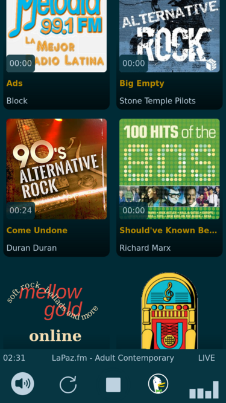

# Display current song playing on streams

[live demo](https://ndlopez.github.io/web_player/)

Since VLC displays *stream* after opening [lapaz.fm](https://stream.consultoradas.com/8042/stream) or *thirdrock-sgplayer* when opening [thirdRock](https://rfcmedia3.streamguys1.com/thirdrock-sgplayer.aac). I decided to build a website to display the current song playing on *lapaz.fm* or *thirdrockradio.net*

Two pages work as web player: [index](https://ndlopez.github.io/web_player/) and [fmlapaz](https://ndlopez.github.io/web_player/fmlapaz.html)

## Web Player <index.html>

*The Strumbellas - Spirits*

Display the current playing song out of 13 (currently) differents streams. LaPaz.fm, 181.fm (Awesome80s,90s Alternative, The Buzz), ~~Third Rock Radio,~~ 113.fm ClassicOne, News Radio x2.  For ThirdRock stream, 
there is a CORS issue with the URL I am fetching data from, it cannot parse anything (those people protect their data fiercely). Although I found a herokuapp website that appends the required *header* to the URL and JavaScript can fetch ~~without problems~~. Currently, the herokuapp no longer accepts requests, so this script no longer works :(. I can no longer request to thirdRock, location error?, no longer streaming via streamguys1.com?. Removed and replaced by KEXP-fm.

As countermeasure, I decided it was too much hassle on the herokuapp server(it says so on its GitHub page), thus I decided to make a Python script to fetch data from the same URL and store it in a JSON file. Python's urllib *doesnt care about headers* and fetches data without problems :)

## FM La Paz - <fmlapaz.html>

Display and store in a playlist on the same page current song and the previously listened songs. 
The URL has some security issues (*expired* SSL certificate) but JavaScript's fetch does not seem to care and gets data without problems. I cannot say the same with C#'s json lib.

About the *expired* certificate: 
The URL I am using is hosted somewhere on the west (where the Sun sets), where I am the Sun is rising, there's a UTC+9 hour difference. The URL's certificate is renewed every day at midnight, so by the time I am fetching data it already *expired*. Perhaps if the URL's server would be connected to some CloudFlare service, this issue might not matter.

*small issue* 
Update time is set to 3min40s (assumed average length of a song). Because of this sometimes a song might me missed and not included in the Playlist, in such case the user can update the list by clicking the <reload> button.

By clicking on the cloud icon, it is possible to download the playlist in JSON format, obviously from the moment the page was opened.

## Unrelated?

Resize images using imageMagick (on Debian)

    $ mogrify -resize 256x256 rfi_logo.png

    $ mogrify -resize 50% rfi_logo.png

    $ mogrify -format jpg *.png

more info [here](https://imagemagick.org/script/mogrify.php)

To create some [wavy path in CSS3 and SVG](https://css-tricks.com/how-to-create-wavy-shapes-patterns-in-css/#top-of-site)
Update: *www.lapaz.fm* has changed sources again. Another server has the id3 ~~icecasthd JSON file is no longer available~~.

Dev only: Open *index.html* in Firefox and access *Web Developer Tools* from Settings Menu.

<!--
<svg id="vol_icon" xmlns="http://www.w3.org/2000/svg" viewBox="0 0 32 32" width="32" height="32" fill="none" stroke="currentcolor" stroke-linecap="round" stroke-linejoin="round" stroke-width="2">
<path fill="#bed2e0" d="M20 16 C20 8 15 2 15 2 L8 10 2 10 2 22 8 22 15 30 C15 30 20 24 20 16 Z"/>
 <path d="M21 2 C21 2 25 6 25 16 25 26 21 30 21 30 M27 4 C27 4 30 8 30 16 30 24 27 28 27 28"/></svg>

div id="player" style="position: fixed;bottom: 0;z-index: 100;float:none;box-sizing: content-box;">
  <ul>
    <li><a>
<label for="vol_input" onclick="volume_mute(0)">
      </label>
      <input id="vol_input" class="volume-vertical" type="range" min="0" max="100" value="80" step="10" oninput="audioConnect.volume = this.value/100" onchange="this.oninput()">

      <-volume-></a>
    </li>
    <li><a title="back to home" href="../index.html">
      <svg id="prev_play" xmlns="http://www.w3.org/2000/svg" viewBox="0 0 42 42" width="42" height="42" fill="#bed2e0" stroke="#2e4054" stroke-linecap="round" stroke-linejoin="round" stroke-width="4">
        <circle stroke-width="0" cx="21" cy="21" r="20"/><-M30 30 L30 10 12 20Z M11 30 L11 10->
        <path fill= "#2e4054" d="M28 28 L28 14 15 21Z M14 28 L14 14"/></svg>
      </a></li>
    <li></li>
    <li><a href="fmlapaz.html" title="Go to FM LaPaz">
      <svg id="next_play" xmlns="http://www.w3.org/2000/svg" viewBox="0 0 42 42" width="42" height="42" fill="#bed2e0" stroke="#2e4054" stroke-linecap="round" stroke-linejoin="round" stroke-width="4">
      <-path d="M9 25 L25 16 9 7Z M25 25 L25 7"/"M12 30 L12 10 30 20Z M31 30 L31 10"->
      <circle stroke-width="0" cx="21" cy="21" r="20"/>
      <path fill="#2e4054" d="M15 28 L15 14 25 21Z M28 28 L28 14" /></svg></a>
    </li>        
    <li><a target="_blank" href="/" title="about this">
      

        
        

</a>
    </li>
  </ul>
</div-->

<!--svg width="18px" height="20px" viewBox="0 0 8 10" xmlns="http://www.w3.org/2000/svg" aria-hidden="true">
      <path transform="translate(-1682.000000, -935.000000)" d="M1687,935 L1687,945 L1690,945 L1690,935 L1687,935 Z M1682,935 L1682,945 L1685,945 L1685,935 L1682,935 Z" fill="currentColor"></path></svg>
    <svg id="sub_play" viewBox="0 0 16 16" width="32px" height="32px" xmlns="http://www.w3.org/2000/svg" aria-hidden="true">
      <path class="paused" d="M12.322 7.576a.5.5 0 010 .848l-6.557 4.098A.5.5 0 015 12.098V3.902a.5.5 0 01.765-.424l6.557 4.098z" fill="currentColor"></path></svg-->

<!--aside id='player2'>

You don't get me high anymorePhantogram

<svg id='play2' 
    xmlns='http://www.w3.org/2000/svg' viewBox='0 0 60 60' width='60' height='60' stroke='#2e4054' fill='#bed2e0' stroke-linecap='round' stroke-linejoin='round' stroke-width='4'>
    <circle class='paused no_mobil' cx='30' cy='30' r='26'/>
    <path class='paused' fill='#2e4054' d='M23 40 L23 20 43 30Z'/></svg>
  

  

    <label for='vol_input' onclick='volume_mute(0)'>
      </label>
      <input id='vol_input' class='no_desktop no_mobil' type='range' min='0' max='100' value='80' step='10' oninput='audioConnect.volume = this.value/100' onchange='this.oninput()'>
  

    

      

        <--span></span->

</aside-->
