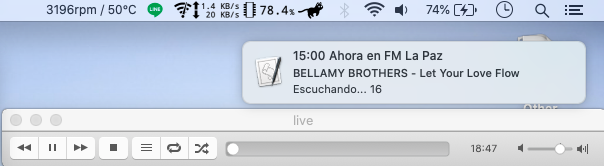
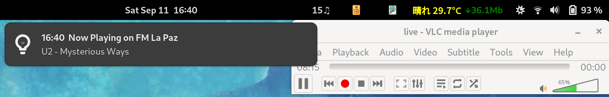

# Display current song playing on lapaz.fm

Since VLC only displays "live" after opening URL[https://icecasthd.net:6192/live]

I decided to build an small application that displays the current song playing on www.lapaz.fm

## MacOS version
### get_fmLaPaz

Programming language: JavaScript, Bash

Editor: VS Code

Environment: MacBookPro / MacOS 15.5

## Gnome-Shell Extension version
### fmLaPaz@moji.physics

Programming language: JavaScript

Editor: Emacs

Environment: Panasonic Let'sNote / Fedora 24

## Windows version
Programming language: C#

~~coming as soon as I learn C# connections with JSON~~

I did learn how to code in C#. The Pre-release is available as a ZIP file.

Go to: [https://github.com/ndlopez/NowPlaying]

## Web version

Open Firefox and check the Developer's log

It is possible to include into any website with some JS code to output JSON data. 
