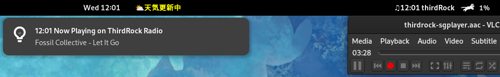

# Display current song playing on laPaz.fm/thirdRock

[live demo](https://ndlopez.github.io/fmLaPazNow/)

Since VLC displays *stream* after opening [lapaz.fm](https://stream.consultoradas.com/8042/stream) or *thirdrock-sgplayer* when opening [thirdRock](https://rfcmedia3.streamguys1.com/thirdrock-sgplayer.aac) Thus, I decided to build a script that displays the current song playing on *lapaz.fm* or *thirdrockradio.net*

Update: *www.lapaz.fm* has changed everything. icecasthd JSON file is no longer available. ~~MacOS notification and Gnome-shell extension NO longer work~~. Made them work by running a Shell script, store the info as JSON file and another JS script will display it.

## MacOS version
### Notification App

Programming language: JavaScript, Bash

Editor: Emacs

### xbar Plugin
On MacOS this is the recommended method to display current song.

The following plugins DO NOT store extra files on SSD/HDD.

1. ThirdRock Radio <xbar\_plugin/get3rdRock.4m.py>

2. FM La Paz <xbar\_plugin/getfmLaPaz.4m.sh>

   It can also fetch artwork and parse it to xbarApp.
   
Environment: MacBookPro / MacOS 15.5

## Gnome-Shell Extension
Dir: *thirdRock@moji.physics* 

On this repository only the *thirdRock* version is available. Please refer to [this link](https://github.com/ndlopez/NowOnFMLaPaz) to get the FMLaPaz version.

The above script uses GJS-Soap library to make a request to fetch data. Thus, all work is done in memory, no data file is written to SSD/HDD.

To install copy the above dir to: 
   $ $HOME/.local/share/gnome-shell/extensions/

Default update time is 3 minutes. To modify, please edit *extension.js* and find the const variable *upTime* and replace *238* by another interval in seconds.

## Windows version (Support for thirdRock only)
Programming language: C#

~~coming as soon as I learn C# connections with JSON~~

I did learn how to code in C#. The Pre-release is available as a ZIP file.

Go to: [https://github.com/ndlopez/NowPlaying]

Update: Windows version no longer displays current song from fm LaPaz, 'cuz the error mentioned above, the new version supports only ThirdRockRadio.

## Web version
click on live demo link above

Dev only: Open *index.html* in Firefox and wait for 3minutes or so. The playlist will populate and update every 3minutes.

By clicking on the cloud icon, it is possible to download the playlist in JSON format, obviously from the moment the page was opened.
