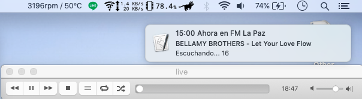

# Display current song playing on laPaz.fm/thirdRock

Since VLC only displays *stream* after opening [lapaz.fm](https://stream.consultoradas.com/8042/stream) or *thirdrock-...* when opening [thirdRock](https://rfcmedia3.streamguys1.com/thirdrock-sgplayer.aac)

Thus, I decided to build a script that displays the current song playing on *lapaz.fm* or *thirdrockradio.net*

Update: *lapaz.fm* has changed everything. icecasthd JSON file is no longer available. ~~MacOS notification and~~ Gnome-shell extension NO longer work.

## MacOS version
### Notification App

Programming language: JavaScript, Bash

Editor: Emacs

### xbar Plugin
1. ThirdRock Radio <xbar\_plugin/get3rdRock.4m.py>

2. FM La Paz <xbar\_plugin/getfmLaPaz.4m.sh>

Environment: MacBookPro / MacOS 15.5

## Windows version
Programming language: C#

~~coming as soon as I learn C# connections with JSON~~

I did learn how to code in C#. The Pre-release is available as a ZIP file.

Go to: [https://github.com/ndlopez/NowPlaying]

Update: Windows version no longer displays current song from fm LaPaz, 'cuz the error mentioned above, I made a version to fetch ThirdRockRadio current Playing song.

## Web version

Open Firefox and check the Developer's log

It is possible to include into any website with some JS code to output JSON data. 
