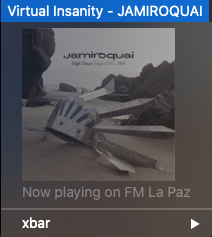

# MacOS version

##installation process:

Download $this folder as a zip file and expand it to $HOME/Public folder

Then, run the following command on the Terminal

$ crontab $HOME/Public/get_fmLaPaz/myjob.cron

Done! 

The application will run every 4 minutes and will display 

the current song playing on https://www.lapaz.fm in the Notification Center.

## xbar plugin
Download [xbar app](https://github.com/matryer/xbar-plugins) and add [this file](https://raw.githubusercontent.com/ndlopez/fmLaPazNow/main/notif_plugin/getFmLaPaz.4m.sh) to your xbar/plugins folder.

As seen on the screenshot not only the current song is displayed but also nice artwork.
 
-------

Programming language: JavaScript, Bash

Editor: Emacs/VIM

Environment: MacBookPro/ MacOS 15.5
