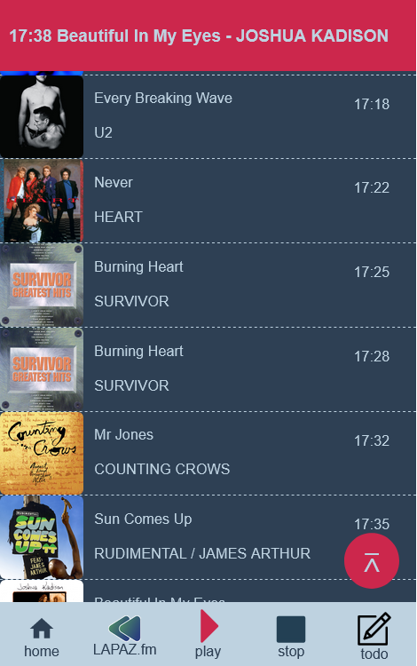

# Display current playing song

## FM La Paz - <index.html>

Display and store in a playlist on the same page current song and the prev listened songs. 
The URL has some security issues (*expired* SSL certificate) but JavaScript's fetch does not seem to care and gets data without problems. I cannot say the same with C#'s json lib.

About the *expired* certificate: 
The URL I am using is hosted somewhere on the west (where the Sun sets), where I am the Sun is rising, there's a UTC+9 hour difference. The URL's certificate is renewed every day at midnight, so by the time I am fetching data it already *expired*. Perhaps if the URL's server would be connected to some CloudFlare service, this issue might not matter.

*small issue* 
Update time is set to 3min20s (average length of a song). Because of this sometimes a song might me missed and not included in the Playlist.

## ThirdRock Radio <thirdRock.html>
Display and store in a playlist on the same page current song. 
JavaScript seems to have a CORS issue with the URL I am fetching data from, it cannot parse anything. So I found a herokuapp website that appends the required *header* to the URL and JavaScript can fetch ~~without problems~~. There are several problems, the herokuapp no longer accepts my requests, so this page no longer works :(

As countermeasure, I decided it was too much hassle on the herokuapp server, it says so on its GitHub page, thus I decided to make a Python script to fetch data from the same URL and store it in a JSON file. Python's urllib doesnt care about headers and fetches data without problems :)

I really do not understand why JavaScript has issues with the URL, I mean I wrote some scripts in Python, Gnome-JavaScript, and Shell (using curl) and they fetch data without problems.
